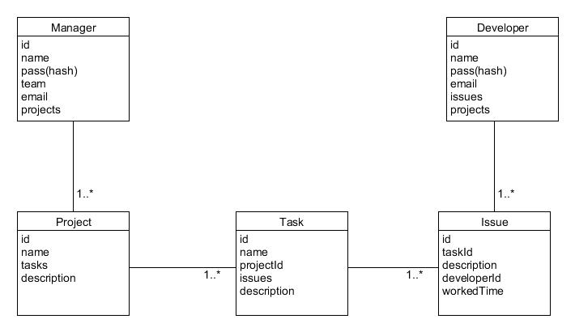
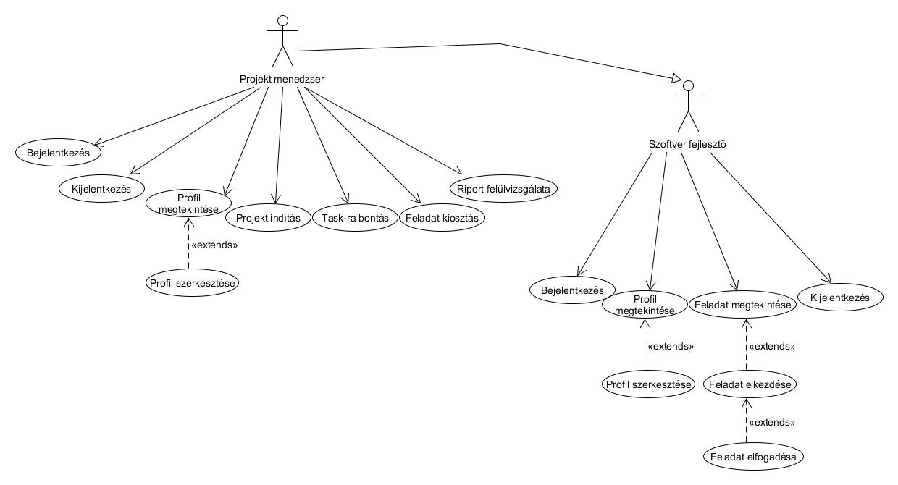
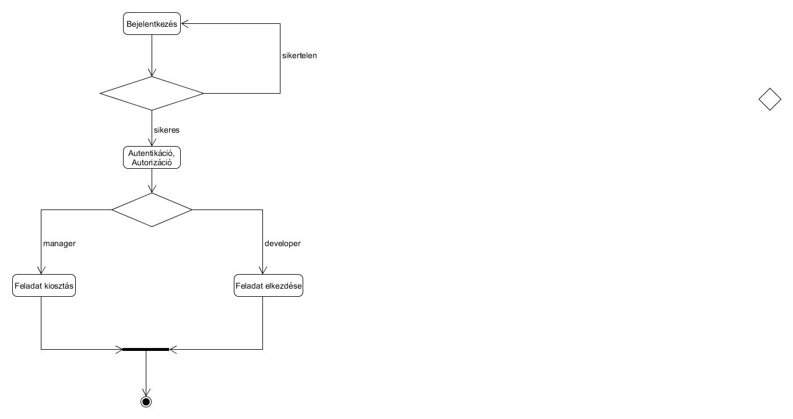
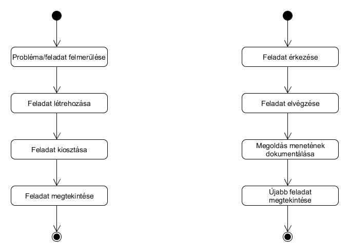
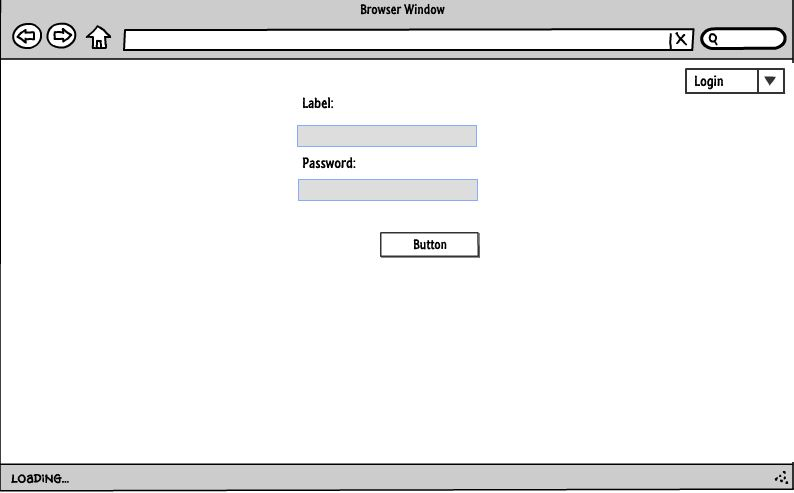
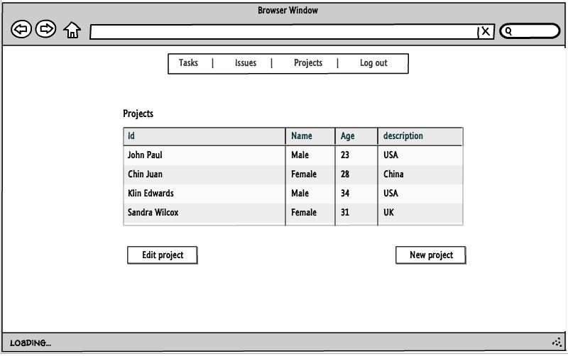
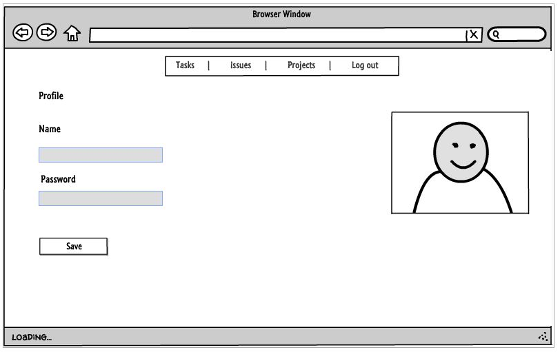

# Szabó Ákos alkalmazások fejlesztése beadandó

## Mini Jira
Issue tracker alkalmazás, mely szoftverfejlesztő cégeknek könnyíti meg a napi feladatok rendszerezését, csoportosítását. Használata során a Projekt Menedzser/vezető fejlesztő kiosztja a feladatot a fejlesztőknek, akik azt elkezdik megoldani, majd ha végzett vele egy rövidebb leírást mellékel hozzá és logolja, hogy mennyi időt töltött el vele.

### Funkcionális követelmények
#### - Vezető fejlesztő/Projekt menedzser

* Bejelentkezhet
* Profilját megtekintheti, szerkesztheti
* Új projektet indíthat
* Projekthez task-ot rendelhet (egy alprojekt/elvégzendő nagyobb feladat csomag)
* A taskhoz issue-kat rendelhet (konkrét feladat, megoldására pár órát szán)
* Felülvizsgálhatja a csapatában dolgozókat, következtetéseket vonhat le
* Kijelentkezhet

#### - Szoftverfejlesztő

* Bejelentkezhet
* Profilját megtekintheti, szerkesztheti
* Rá váró feladatokat megtekintheti
* Elfogadhatja a feladatot
* Feladatát elkezdheti
* Leírást adhat a megvalósított feladatról
* Kijelentkezhet

### Nem funkcionális követelmények

* Átláthatóság
* Rövid válaszidő
* Biztonság

### Modellek

### Jogosultságok
#### - Vezető fejlesztő/Projekt menedzser

* Mindent megtekinthet 
* Szerkeszthet, létrehozhat (Projekt, Task, Issue)

#### - Szoftverfejlesztő

* Feladatot elkezdhet, erről leírást adhat
* Láthatja az összes feladatot, de csak a sajátját módosíthatja (work log) 

### Oldaltérkép 
#### - Vezető fejlesztő/Projekt menedzser

* Bejelentkezés
* Projekt, Task, Issue listák megtekintése
* Fejlesztő lista megtekintése, feladatok kiosztása
* Bármi felülbírálása
* Profil oldal

#### - Szoftverfejlesztő

* Bejelentkezés
* Projekt, Task, Issue megtekintés
* Saját issue szerkesztése (Megvalósítás leírása, idő beállítása) 
* Profil szerkesztése

### Use-case diagramok

### Folyamatok
* Bejelentkezés

* Feladat kiosztás, feladat elvégzése

### Desing terv
##### Kezdetleges, letisztult oldalak (változhatnak a fejlesztés során)
* Bejelentkezés

* Projektek listázása

* Munka logolás

* Profil szerkesztése

###Felhasználói dokumentáció

* A felhasználó bejelentkezés nélkül csak a projekteket láthatja a Projects menü alatt. 

* A signin fülön regisztrálhat, utána eléri az alkalmazás többi funkcióját is, indíthat egy projektet ( több fajtát ) 
  Projects fül -> create project vagy start project fül. 
  
* Projekt létrehozása után a felhasználó issue-kat hozhat létre, ezek mindig egy projekthez tartoznak és mindig egy felhasználót rendelünk hozzá, akinek meg kell oldani a feladatot. 

* A felhasználó a jobb felső sarokban a nevére kattintva megtekintheti, hogy milyen issue-kat rendeltek hozzá.

####Végpontok

* / - kezdőoldal
* /register - regisztráció
* /login - bejelentkezés
* /logout - kijelentkezés
* /projects - projektek listája
* projects/ {id} - itt a projekt egyesével való részletesebb leírása
* /projects/{id}/edit - projekt szerkesztése
* /createproject - projekt létrehozása
* /projects/{id}/createissue - issue létrehozása projethez
* /projects/logwork/{id} - elvégzett munka naplózása
* /removewlog/{id} - naplóbejegyzés törlése 
* /projects/{pid}/removeissue/{uid} - issue törlése
* /profile/{id}/edit - profil szerkesztése
* /profile/{id} - profil megtekintése

####Fogalomjegyzék 

* issue- egy projekthez tartozó részfeladat
* assignee - akit kijelöltek a munka elvégzésére, egy issue mindig tartozik egy emberhez
* worklog - az issue-hoz tartozik, rövid leírás, hogy a feladatból mit valósítottunk meg és mennyi idő alatt

A profil oldalon a felhasználó megtekintheti, hogy milyen issue-k tartoznak hozzá és azt, hogy milyen naplóbejegyzései vannak

####Telepítés 

a. ZIP letöltése

b. akossszabo/alkfejlbead klónozása

c. akossszabo/alkfejlbead forkolása és a saját repo klónozása

npm install
.env.example fájl átnevezése .env-re
npm run dev paranccsal futtatni
localhost:3333 megnyitása, itt fog futni az alkalmazás

####Mappaszerkezet

Számunkra fontosabb mappák: 

* resources/views - itt találhatók meg a a megjelenítendő oldalak
* database - itt találhatók a migrationok
* App/Http - a Controllerek, amik az adatbázis és a view-k közti kommunikációt valósítja meg
* App/Model - Az adatbázisok közti kapcsolatok meghatározása

####Hardver követelmények

* számítógép és windows/linux/ mac os

####Kliens oldali funkciók

* Validáció (Projekt létrehozása form): az alkalmazás valós időben ellenőrzi, hogy az egyes helyen megadott adatok megfelelnek-e az elvárt feltételeknek.
* Validáció (Issue létrehozása form): az alkalmazás valós időben ellenőrzi, hogy az egyes helyen megadott adatok megfelelnek-e az elvárt feltételeknek.
* Bejelentkezés (ajax) : Ha a felhasználó a 'login' gombra kattint egy felugró ablakban adhatja meg az adatait, sikeres belépés után az alkalmazás a kezdőoldalra irányítja a felhasználót. 
* Issue törlése (ajax) : Issue törlésekor az alkalmazás megerősítést kér egy felugró ablakban
* Worklog törlése (ajax) : Worklog törlésekor az alkalmazás megerősítést kér egy felugró ablakban

#####Tesztek

* Issue és worklog létrehozása és törlése (Ezek egy file-ban) 
* Bejelentkezés tesztelése
* Regisztráció és profil szerkesztése ( Egy file-ban) 
