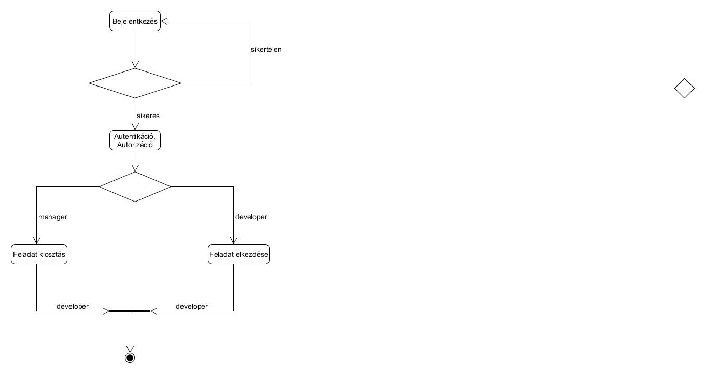

# Szabó Ákos alkalmazások fejlesztése beadandó

## Mini Jira
Issue tracker alkalmazás, mely szoftverfejlesztő cégeknek könnyíti meg a napi feladatok rendszerezését, csoportosítását. Használata során a Projekt Menedzser/vezető fejlesztő kiosztja a feladatot a fejlesztőknek, akik azt elkezdik megoldani, majd ha végzett vele egy rövidebb leírást mellékel hozzá és logolja, hogy mennyi időt töltött el vele.

### Funkcionális követelmények
#### - Vezető fejlesztő/Projekt menedzser

* Bejelentkezhet
* Profilját megtekintheti, szerkesztheti
* Új projektet indíthat
* Projekthez task-ot rendelhet (egy alprojekt/elvégzendő nagyobb feladat csomag)
* A taskhoz issue-kat rendelhet (konkrét feladat, megoldására pár órát szán)
* Felülvizsgálhatja a csapatában dolgozókat, következtetéseket vonhat le
* Kijelentkezhet

#### - Szoftverfejlesztő

* Bejelentkezhet
* Profilját megtekintheti, szerkesztheti
* Rá váró feladatokat megtekintheti
* Elfogadhatja a feladatot
* Feladatát elkezdheti
* Leírást adhat a megvalósított feladatról
* Kijelentkezhet

### Nem funkcionális követelmények

* Átláthatóság
* Rövid válaszidő
* Biztonság

### Modellek

### Jogosultságok
#### - Vezető fejlesztő/Projekt menedzser

* Mindent megtekinthet 
* Szerkeszthet, létrehozhat (Projekt, Task, Issue)

#### - Szoftverfejlesztő

* Feladatot elkezdhet, erről leírást adhat
* Láthatja az összes feladatot, de csak a sajátját módosíthatja (work log) 

### Oldaltérkép 
#### - Vezető fejlesztő/Projekt menedzser

* Bejelentkezés
* Projekt, Task, Issue listák megtekintése
* Fejlesztő lista megtekintése, feladatok kiosztása
* Bármi felülbírálása
* Profil oldal

#### - Szoftverfejlesztő

* Bejelentkezés
* Projekt, Task, Issue megtekintés
* Saját issue szerkesztése (Megvalósítás leírása, idő beállítása) 
* Profil szerkesztése

### Use-case diagramok

### Folyamatok

### Végpontok

### Desing terv
